# Preface

This document describes the slack-xlrelease-app implementation.

See the *XL Release Reference Manual* and link:https://api.slack.com/slack-apps[*Building Slack App*] for background information on XL Release and Slack App.

# Overview

A slack app to create and track releases from Slack. This slack app will allow users to get status of tasks in slack and also take action on them.

## Installation

This slack app uses link:https://www.vaultproject.io/[Vault] backed by link:https://www.consul.io/[Consul] to store secrets. It also uses link:https://redis.io/[Redis] as a database and cache.

You can use `docker/infra/docker-compose.yml` to spin up vault, consul, and redis.

It is recommended that you setup https for vault server. To do that, configure TLS Certificate and key path in `docker/config/vault.hcl` and set `tls_disable = 0`

### Vault, consul, and redis setup

Change default `REDIS_PASSWORD` in `docker/.env` file. Now change directory to `docker/infra/`.

```
cd docker/infra/
```

For initial setup, follow below steps.

1. Start services: run `docker-compose up`
1. Init Vault: run `./scripts/setup.sh` This will create keys.txt in `docker/data` directory. Make sure nobody has access to it. Store *Vault Token* value in `docker/.env` file.

For subsequent runs, follow below steps.

1. Start services: run `docker-compose up`
1. Unseal Vault: run `./scripts/unseal.sh`

To take backup, run `./scripts/backup.sh`

To clean up everything, follow below steps.

1. Stop services: run `docker-compose -f docker-compose-infra.yml down --volumes`
1. Clear persisted data: run `./scripts/clean.sh`

### Create Slack App

Now, we have to create slack app for XL Release.

* Visit link:https://api.slack.com/apps[Slack Apps] and click on *Create New App*

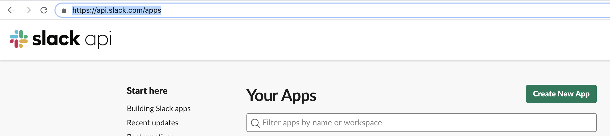

* Add app name as *XL Release* and choose your development slack workspace.

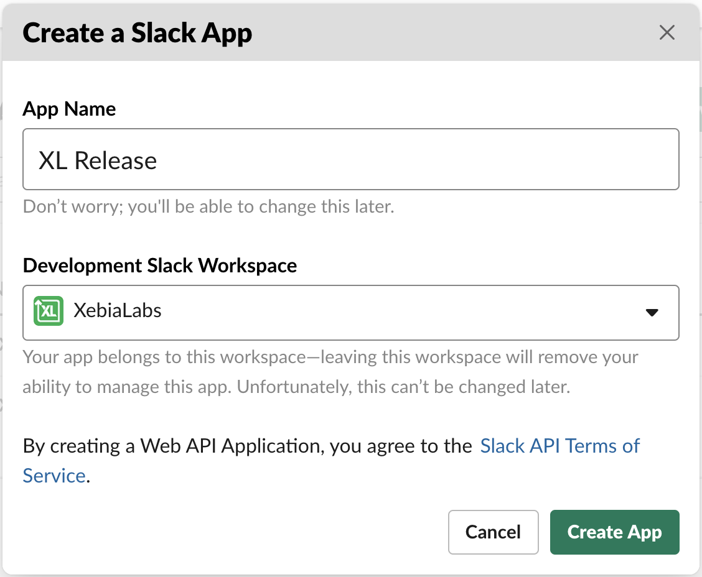

* Once the new app is created, visit Basic information page and copy value of *Client ID*, *Client Secret*, and *Signing Secret* in `docker/.env` file. You can also customise icon for your Slack app from Display information page.

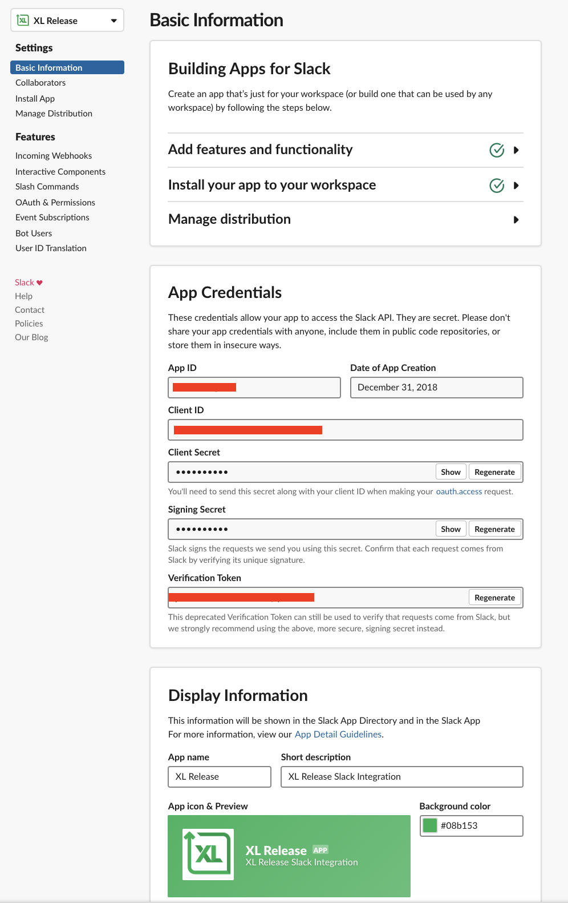

### Start Slack XL Release Bot

To start bot, execute below commands.

```
cd docker/app/
docker-compose up
```

This will start slack bot on port 5000. However it is required to open tunnel to internet to communicate to slack app.

To do that, use link:https://ngrok.com[ngrok] or setup reverse proxy using nginx or apache.

To use ngrok, run `ngrok http 5000` to open tunnel and copy the url which will be used to configure slack app.

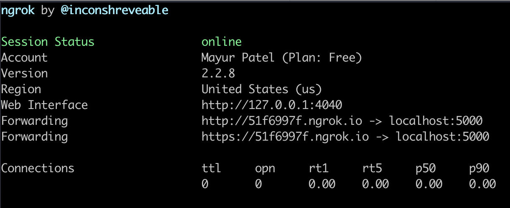


### Configure features for your slack app

#### Add bot user

Click on *Bot Users* link from slack app configuration page and add username for your bot.

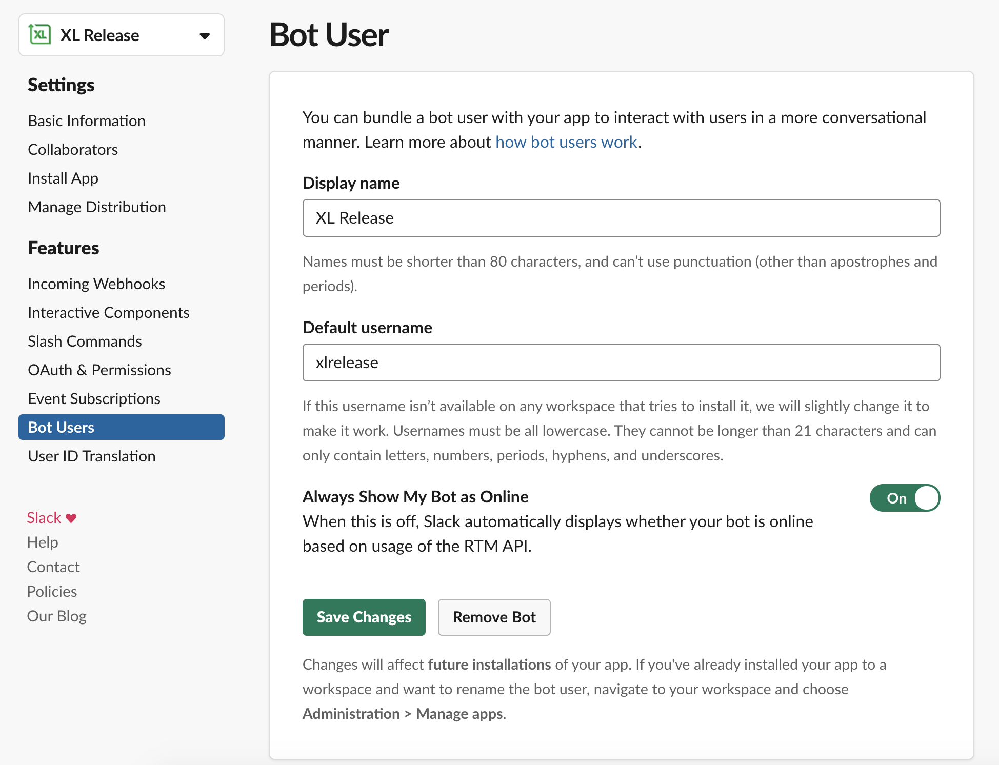

#### Configure interactive components

Click on *Interactive Components* link and add interactivity url.

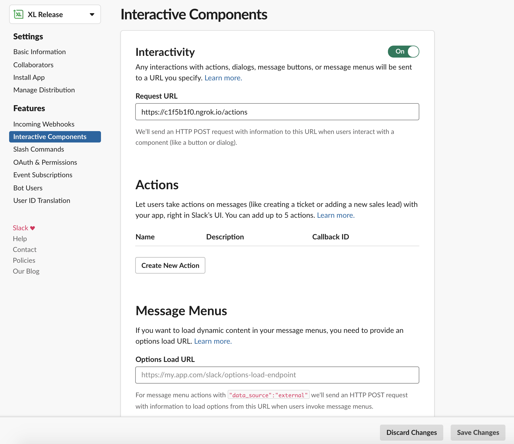

#### Add slash command

Click on *Slash Commands* link and add new slash command as below.

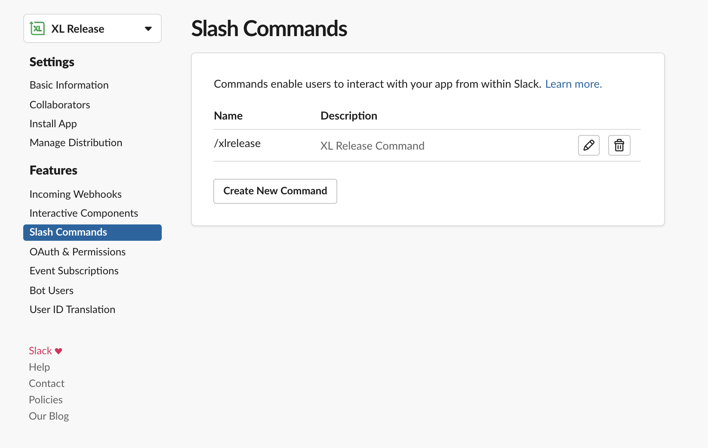
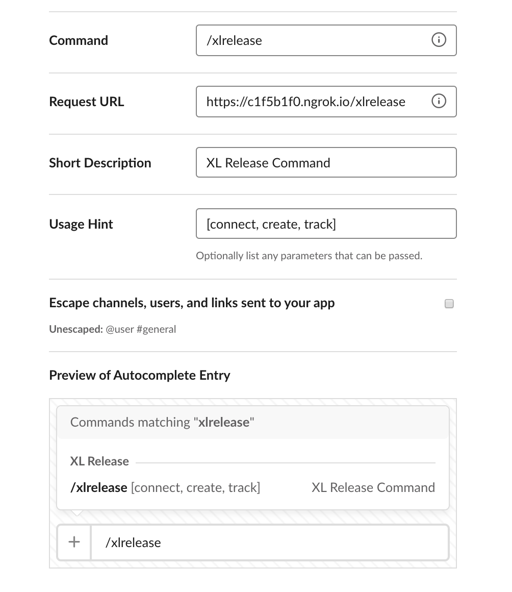

#### Add events

Click on *Event Subscriptions* link and enable events. Add Request URL for events. Subscribe to _message.im_ event.

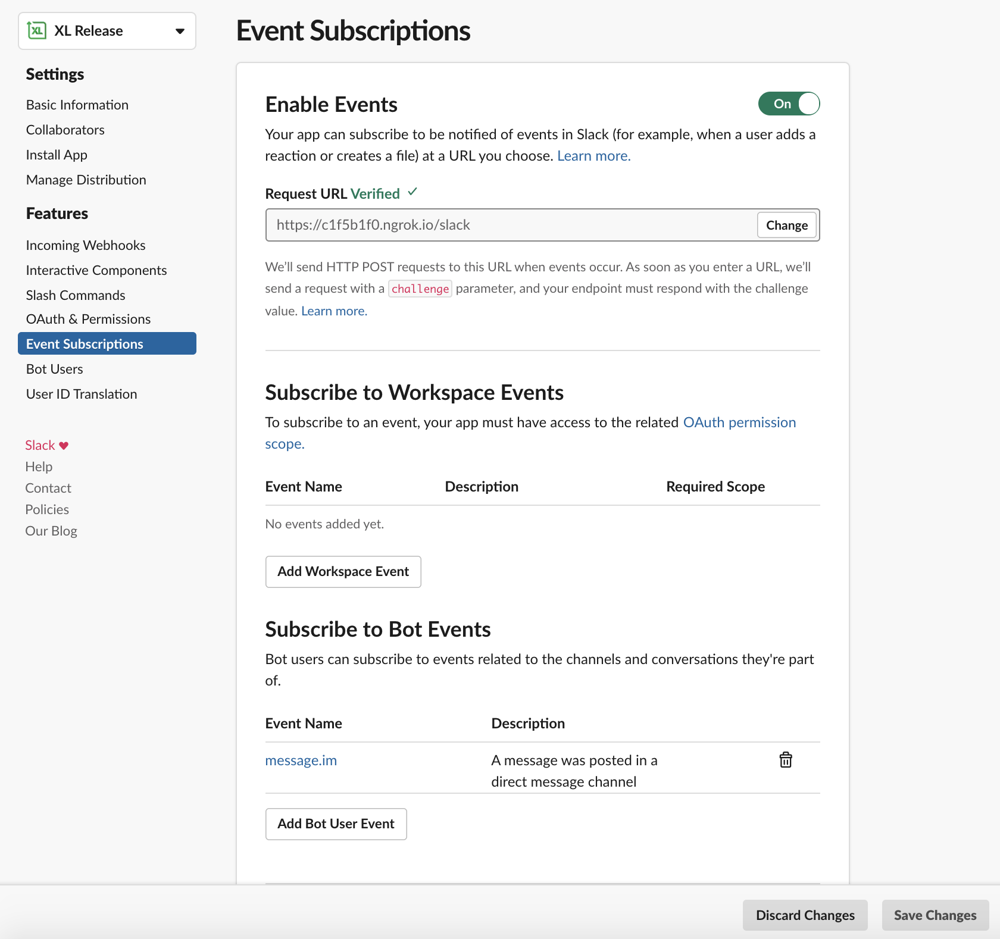

#### Add scope and permissions

Click on *OAuth & Permissions* link and add redirect url to thanks page. Also add scopes shown in below image.

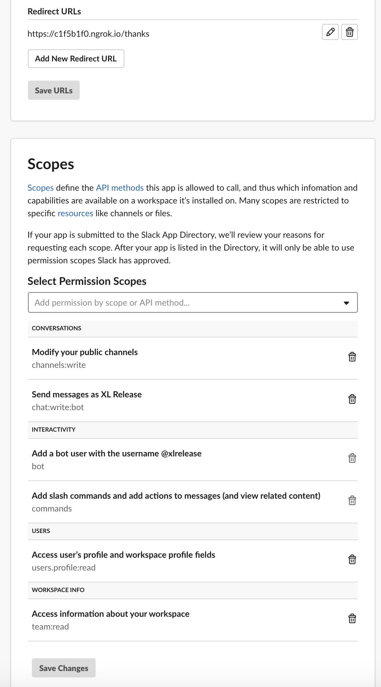

### Install App in your workspace

To add slack app to your slack workspace, open bot url in web browser and click on _Add to Slack_ button and authorize the changes.

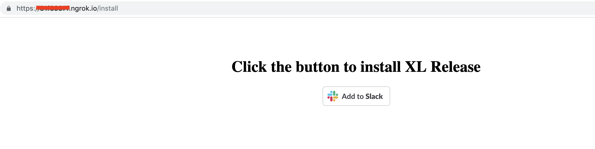


